# 设备远程控制

Tkinter 桌面程序，通过 TCP 协议接收服务器事件并控制 PLC 完成打印流程和闪喷维护。

- 主程序：`device_control.py`
- 配置文件：`config.toml`（修改后重启生效，缺失或格式错误时使用内置默认值）

## 连接

- **设备**：TCP 直连，周期上报状态帧 `POS:X=+014.88,Y=+000.00,Z=+000.00,D=0,G=0`（X/Y/Z 位置、UV 灯、滚子状态）
- **扫描服务器**：`127.0.0.1:19090`，负责闪喷（`FLASH`）指令，回送 `OK ...` 结果

> **设备协议限制：Y 相对移动指令最多只能有两位小数。** `PASS_READY` 的 `STEP` 单位为 μm，程序先换算成 mm，再四舍五入到两位小数后发送。例如：`STEP=1714` → `Y+1.71`，`STEP=1715` → `Y+1.72`，`STEP=-1715` → `Y-1.72`。Y 的到位目标也必须使用舍入后的距离计算，不能使用原始的三位小数值。

## 服务器驱动打印流程

客户端仅运行服务器事件驱动流程，不再提供或执行手动打印自动循环。

<!-- 手动自动循环流程已移除，以下历史内容仅保留兼容说明
    LOCK --> PREHOME[prehome: X 移动到起始位置 X_HOME]
    LOCK --> LISTEN[等待服务器广播 LAYER_START LAYER=1]

    PREHOME --> END[向终点运动: X = X_END X >= UV距离 时开启自动UV灯]
    LISTEN --> END

    END --> CHK{X 到达终点}
    CHK --> CNT[计数: 闪喷计数+1]
    CNT --> ZC{打印层数达到 layers 倍数}
    ZC -- 是 --> ZDOWN[Z 下降 step 0.5mm, 计数清零]
    ZDOWN --> FC{启用维护闪喷 且 闪喷计数 ≥ 间隔}
    ZC -- 否 --> FC
    FC -- 否 --> HOME[向起点运动: X = X_HOME]

    FC -- 是, 闪喷计数清零 --> FON[发送 FLASH 开启闪喷]
    FON --> WAIT2[等待 pause_ms 2s]
    WAIT2 --> FCHK{闪喷仍开启?}
    FCHK -- 是 --> FOFF[发送 FLASH 关闭, 等待回送确认/超时]
    FOFF --> HOME
    FCHK -- 否 --> HOME

    HOME --> HCHK{X 到达起点}
    HCHK --> DC{内循环剩余 > 0?}
    DC -- 是 --> Y0{Y步进 = 0?}
    Y0 -- 是 --> END
    YSTEP --> END

    DC -- 否, 本组完成 --> OC{大循环剩余 > 1?}
    OC -- 是 --> YBACK[Y 回到起始位置, 大循环剩余-1, 重置内循环次数]
    YBACK --> END
    OC -- 否 --> DONE[全部完成: 播放完成音效, 解锁]
    DONE --> FIN([结束])
-->

### 服务器驱动任务流程（EVENT START_JOB）

服务端广播 `EVENT START_JOB TOTAL_LAYERS=<总层数>` 启动打印任务，`TOTAL_LAYERS` 是扫描打印根目录得到的连续编号子文件夹数量；随后广播 `LAYER_START` / `PASS_READY` 等事件。全部图层正常打印完成时，服务端广播 `EVENT PRINT_JOB_COMPLETED TOTAL_LAYERS=<总层数>`，客户端仅以该事件作为打印完成和任务结束依据。程序用独立的 `_start_job()` 逻辑处理，不复用手动「开始」逻辑。收到 `START_JOB` 时界面打印进度初始化为 `0/<总层数>`，收到 `LAYER_START LAYER=<当前层>` 后更新为 `<当前层>/<总层数>`。

```mermaid
flowchart TD
    EV([服务器广播 EVENT START_JOB<br/>TOTAL_LAYERS=总层数]) --> AL{已在自动循环?}
    AL -- 是 --> IGN[忽略重复 START_JOB]
    AL -- 否 --> LOCK
    subgraph LOCK_ACTIONS[ ]
        direction LR
        LOCK[锁定 X/Y/Z 三轴] --> PY[记录当前 Y 位置为 Y 初始位置]
    end
    LOCK --> PREHOME[prehome: 移动 X 到起始位置 X_HOME]
    PREHOME --> LISTEN[/持续监听 LAYER_START<br/>更新当前层直到 TOTAL_LAYERS/]
    LISTEN --> CONSUME[收到任意合法层时从事件队列移除<br/>LAYER_START LAYER=n]
    CONSUME --> ZCOUNT{打印层数达到<br/>z_step.layers 的倍数?}
    ZCOUNT -- 是 --> ZSTEP[Z 下降 z_step.step]
    ZSTEP --> ZWAIT[等待 Z 到位]
    ZWAIT --> YHOME[移动 Y 到任务开始时记录的 Y 初始位置]
    ZCOUNT -- 否 --> YHOME
    YHOME --> YHOME_WAIT[等待 Y 到位]
    YHOME_WAIT --> WAIT_PASS[/循环等待 EVENT PASS_READY/]
    WAIT_PASS --> PASS_EVENT[从事件队列移除 PASS_READY<br/>CURRENT / TOTAL / STEP / EMPTY]
    PASS_EVENT --> PASS_UI[显示 PASS 进度 CURRENT/TOTAL]
    PASS_UI --> EMPTY{EMPTY = 1?}
    EMPTY -- 是，跳过Y/X运动 --> XHOME
    EMPTY -- 否 --> YSTEP[解析 STEP: μm ÷ 1000 = mm<br/>四舍五入到两位小数后移动 Y]
    YSTEP --> YWAIT[等待 Y 移动到位]
    YWAIT --> UVMODE{自动UV灯已开启?}
    UVMODE -- 否 --> END[使用 config.toml 的 x_end<br/>向 X 终点运动]
    UVMODE -- 是 --> UVEND[使用 config.toml 的 x_end_withuv<br/>向 X 终点运动]
    UVEND --> UVON{X ≥ uv_offset?}
    UVON -- 是 --> LAMPON[开启 UV 灯]
    UVON -- 否 --> UVON
    END --> ZERO[X 到达 x_end 即视为 PASS 完成<br/>不等待 PASS_REMAINING_ZERO]
    LAMPON --> UVARRIVE[等待 X 到达 x_end_withuv]
    UVARRIVE --> LAMPOFF[关闭 UV 灯]
    LAMPOFF --> ZERO_UV[关闭 UV 后视为 PASS 完成<br/>不发送急停]
    ZERO_UV --> COUNT
    ZERO --> COUNT[闪喷计数 +1<br/>界面显示计数]
    COUNT --> FLASH_DUE{启用维护闪喷 且<br/>闪喷计数 ≥ flash.interval?}
    FLASH_DUE -- 是 --> FLASH_RESET[执行维护闪喷<br/>闪喷计数清零]
    FLASH_RESET --> XOFFSET[X 正向偏移 flash.x_offset]
    XOFFSET --> XOFFSET_WAIT[等待 X 到位]
    XOFFSET_WAIT --> STOP_WAIT[按 config.toml 配置等待]
    FLASH_DUE -- 否 --> STOP_WAIT
    STOP_WAIT --> XHOME[移动 X 到起始位置 X_HOME]
    XHOME --> XHOME_WAIT[等待 X 到位]
    XHOME_WAIT --> PASS_DONE{CURRENT < TOTAL?}
    PASS_DONE -- 是 --> WAIT_PASS
    PASS_DONE -- 否 --> LISTEN
    COMPLETE_EVENT([服务器广播 EVENT PRINT_JOB_COMPLETED<br/>TOTAL_LAYERS=本次任务总层数]) --> CLEAR_JOB[结束全部流程<br/>打印/PASS进度归零<br/>清空记录的 Y 初始位置]
    CLEAR_JOB --> FIN([结束])
    classDef yInitial fill:#fff3cd,stroke:#f59e0b,stroke-width:3px,color:#7c2d12,font-weight:bold
    classDef emergency fill:#fee2e2,stroke:#dc2626,stroke-width:3px,color:#7f1d1d,font-weight:bold
    classDef zStep fill:#dcfce7,stroke:#16a34a,stroke-width:3px,color:#14532d,font-weight:bold
    class PY yInitial
    class ZCOUNT,ZSTEP,ZWAIT zStep
    class FLASH_DUE,FLASH_RESET,XOFFSET,XOFFSET_WAIT zStep
    class PREHOME emergency
    class YHOME yInitial
    style LOCK_ACTIONS fill:none,stroke:none
```

> 说明：`START_JOB` 中的 `TOTAL_LAYERS` 记录为任务总层数，层进度初始化为 `0/TOTAL_LAYERS`。收到 `EVENT PRINT_JOB_COMPLETED TOTAL_LAYERS=n` 后，无论事件中的层数是否与当前任务记录一致，只要当前存在服务器自动任务即直接结束全部流程，不显示客户端弹窗。

> 每个合法图层开始时，程序根据当前打印层数判断是否达到 `[z_step].layers` 的倍数。达到时按 `[z_step].step` 控制 Z 下降并等待 Z 到位，然后才让 Y 回到任务初始位置；未达到倍数则直接执行 Y 回初始位置。若 Z 目标超出配置行程，自动流程中止。

设备周期上报的 `POS:X=...,Y=...,Z=...,D=...,G=...` 状态帧仍用于刷新坐标、开关状态和运动到位判断，但不再写入“指令日志”区域；最新一帧仍显示在界面的“最后上报”位置。

### 段（leg）说明

自动循环由多个运动段组成，每段到达（`_check_arrival` 判定位置公差内）后推进下一段（`_auto_advance`）：

| 段 | 含义 | 下一步 |
| --- | --- | --- |
| `prehome` | 先回 X 起始位置，避免当前位置不确定 | 到达后进入 `wait_layer`（与 LAYER_START 并行的等待条件） |
| `wait_layer` | 等待并消费任意合法的 `EVENT LAYER_START`，更新层进度并检查层数倍数 | 达到 `[z_step].layers` 的倍数 → `layer_zstep`；否则 → `layer_yhome` |
| `layer_zstep` | 每层开头若 X 循环计数达到配置阈值，Z 下降 `[z_step].step`、计数清零并等待 Z 到位 | → `layer_yhome` |
| `layer_yhome` | 每层开始时 Y 绝对移动到任务开始时记录的 Y 初始位置并等待到位 | → `wait_pass_ready` |
| `wait_pass_ready` | 循环等待并消费最新的合法 `EVENT PASS_READY`，清除同一等待窗口内更早的过期事件，显示 `CURRENT/TOTAL` | `EMPTY=1` → 当前 PASS 完成；`EMPTY=0` → `pass_ystep` |
| `pass_ystep` | 将 `STEP` 从 μm 转成 mm，四舍五入到两位小数，按正负号执行 Y 相对移动并等待到位 | → `end`（执行当前 PASS 的 X 终点运动） |
| `server_flash_pause` | PASS 到达终点后，若已启用维护闪喷且闪喷计数达到 `[flash].interval`，则将闪喷计数清零并执行维护闪喷 | 闪喷结束 → `wait_after_pass_stop` |
| `wait_after_pass_stop` | PASS 到达 X 终点后的配置等待；达到闪喷间隔时先完成维护闪喷，随后按配置时长等待 | → `pass_return_home` |
| `end` | X 向终点运动；到达即视为服务器 PASS 完成，不等待 ZERO 或急停 | → `wait_after_pass_stop` |
| `pass_return_home` | 每个服务器 PASS 完成后移动 X 到 `X_HOME` 并等待到位 | 到位后判断 `CURRENT < TOTAL`：是 → `wait_pass_ready`；否 → `wait_layer` |
| `home` | X 回起点，完成一次内循环 | 内循环剩余>0 → `ystep`；否则 → 结束本组 |
| `ystep` | 内循环间 Y 按方向步进 | → `end`（下一次内循环） |
| `yback` | 大循环组间 Y 回起始位置 | → `end`（新一组内循环） |

### 关键参数（config.toml）

| 键 | 说明 |
| --- | --- |
| `[auto_cycle] x_home / x_end` | X 轴往返端点 |
| `[auto_cycle] y_home` | prehome 阶段 X 到位后，Y 移动到的起始位置 |
| `[auto_cycle] x_end_withuv` | 自动 UV 开启时 PASS 使用的 X 终点 |
| `[auto_cycle] uv_offset` | 自动 UV 开启阈值；X 达到该位置时开灯，默认 `120 mm` |
| `[auto_cycle] pass_stop_wait_seconds` | PASS 到达 X 终点后的等待时间（秒） |
| `[z_step] layers / step` | 打印层数每达到 `layers` 的倍数下降 `step` mm |
| `[flash] interval` | 维护闪喷间隔，即累计多少次 X 循环/急停后执行一次维护闪喷；仅通过配置文件设置，UI 不提供输入框；必须为正整数，默认 `10` |
| `[flash] pause_ms` | 维护闪喷暂停时长 (ms) |
| `[flash] x_offset` | 开启维护闪喷前 X 轴正向偏移量 (mm)，默认 `0` |

### 维护闪喷（PASS 终点计数达到间隔时）

达到配置的闪喷间隔后，先按 `[flash].x_offset` 让 X 轴正向偏移并等待到位，再发送 `FLASH` 开启闪喷；等待 `pause_ms` 后若闪喷仍开启则再次发送 `FLASH` 关闭并等待回送确认（带超时保护），确认关闭后继续流程。服务器驱动流程不执行自动压墨。

### 自动 UV 灯（可选）

- 自动 UV 关闭时，PASS 使用 `x_end`，X 到达终点即完成，不发送 `q` 急停。
- 自动 UV 开启时，PASS 使用 `x_end_withuv`；X ≥ `[auto_cycle] uv_offset` 时开灯，X 到达终点后关灯并完成 PASS，不等待 `PASS_REMAINING_ZERO`。其余运动段一律关灯。
- 停止/中止/急停/断开时自动关灯。

## 其他功能

- **点动**：按配置步长 `[jog] steps` 移动各轴；运动中有等待目标时该轴控件锁定。
- **X/Z 轴预设**：一键移动到常用位置（含可配置的「压墨高度」）。
- **闪喷按钮**：手动发送 `FLASH`。
- **自定义指令**：输入原始指令发送到「设备」或「扫描服务器」（扫描服务器自动追加 `\r\n`）。
- **停止**：事件队列右上角“停止”按钮立即发送 `q`，强制终止服务器打印、清空任务事件、重置进度并解锁三轴。
