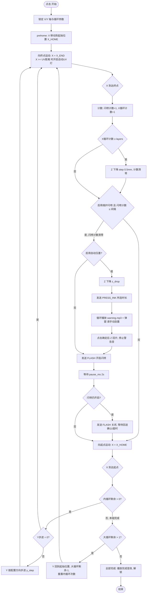

# 设备远程控制

Tkinter 桌面程序，通过 TCP 协议控制 PLC 设备完成打印自动循环、闪喷维护、自动压墨等动作。

- 主程序：`device_control.py`
- 配置文件：`config.toml`（修改后重启生效，缺失或格式错误时使用内置默认值）

## 连接

- **设备**：TCP 直连，周期上报状态帧 `POS:X=+014.88,Y=+000.00,Z=+000.00,D=0,G=0`（X/Y/Z 位置、UV 灯、滚子状态）
- **扫描服务器**：`127.0.0.1:19090`，负责闪喷（`FLASH`）与压墨（`PRESS_INK <秒数>`）指令，回送 `OK ...` 结果

## 打印自动循环流程

自动循环在 **X 起点↔终点** 之间往返（每次为一个"内循环"），循环间按配置的 Y 步进移动；多组时组间 Y 回到起始位置，构成"大循环"。

### 段（leg）说明

自动循环由多个运动段组成，每段到达（`_check_arrival` 判定位置公差内）后推进下一段（`_auto_advance`）：

| 段 | 含义 | 下一步 |
| --- | --- | --- |
| `prehome` | 先回 X 起始位置，避免当前位置不确定 | → `end` |
| `end` | X 向终点运动 | 计数 → 维护闪喷（可选）或 → `home` |
| `home` | X 回起点，完成一次内循环 | 内循环剩余>0 → `ystep`；否则 → 结束本组 |
| `ystep` | 内循环间 Y 按方向步进 | → `end`（下一次内循环） |
| `yback` | 大循环组间 Y 回起始位置 | → `end`（新一组内循环） |

### 关键参数（config.toml）

| 键 | 说明 |
| --- | --- |
| `[auto_cycle] x_home / x_end` | X 轴往返端点 |
| `[auto_cycle] y_step` | Y 步进输入框默认距离 (mm) |
| `[auto_cycle] y_step_dir` | Y 步进方向：`"-"` 负向减小 / `"+"` 正向增大 |
| `[z_step] layers / step` | X 循环每 `layers` 次下降 `step` mm |
| `[flash] pause_ms` | 维护闪喷暂停时长 (ms) |
| `[press_ink] z_drop / durations / press_z` | 压墨 Z 升降量、时长可选值、压墨高度预设 |
| `[speeds] x / y / z` | 各轴速度，用于预计完成时间 (mm/s) |

### 维护闪喷 / 自动压墨（在 X 终点暂停）

1. **自动压墨**（可选）：先 Z 下降 `z_drop` → 发送 `PRESS_INK <所选时长>` → 循环播放 `assets/warning.mp3` 并弹出「请手动刮墨」模态框 → 点击确定后 Z 回升，再进入闪喷。模态框期间自动循环暂停等待人工操作。
2. **闪喷**：发送 `FLASH` 开启闪喷，等待 `pause_ms`(2s) 后若闪喷仍开启则再次发送 `FLASH` 关闭并等待回送确认（带超时保护，避免卡住），确认关闭后才移动 X 回起点。

### 自动 UV 灯（可选）

- X 向终点移动过程中，X ≥ UV 灯水平距离时自动开灯；其余段一律关灯。
- 停止/中止/急停/断开时自动关灯。

## 其他功能

- **点动**：按配置步长 `[jog] steps` 移动各轴；运动中有等待目标时该轴控件锁定。
- **X/Z 轴预设**：一键移动到常用位置（含可配置的「压墨高度」）。
- **闪喷 / 压墨按钮**：手动发送 `FLASH`、`PRESS_INK <所选时长>`；压墨时长预设 2s/5s/10s。
- **自定义指令**：输入原始指令发送到「设备」或「扫描服务器」（扫描服务器自动追加 `\r\n`）。
- **急停**：立即发送 `q` 打断所有运动并终止自动循环。
