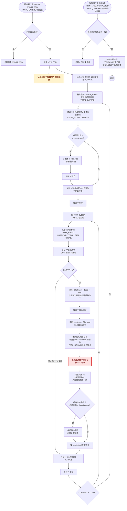

# 设备远程控制

Tkinter 桌面程序，通过 TCP 协议接收服务器事件并控制 PLC 完成打印流程、闪喷维护和自动压墨。

- 主程序：`device_control.py`
- 配置文件：`config.toml`（修改后重启生效，缺失或格式错误时使用内置默认值）

## 连接

- **设备**：TCP 直连，周期上报状态帧 `POS:X=+014.88,Y=+000.00,Z=+000.00,D=0,G=0`（X/Y/Z 位置、UV 灯、滚子状态）
- **扫描服务器**：`127.0.0.1:19090`，负责闪喷（`FLASH`）与压墨（`PRESS_INK <秒数>`）指令，回送 `OK ...` 结果

> **设备协议限制：Y 相对移动指令最多只能有两位小数。** `PASS_READY` 的 `STEP` 单位为 μm，程序先换算成 mm，再四舍五入到两位小数后发送。例如：`STEP=1714` → `Y+1.71`，`STEP=1715` → `Y+1.72`，`STEP=-1715` → `Y-1.72`。Y 的到位目标也必须使用舍入后的距离计算，不能使用原始的三位小数值。

## 服务器驱动打印流程

客户端仅运行服务器事件驱动流程，不再提供或执行手动打印自动循环。

<!-- 手动自动循环流程已移除，以下历史内容仅保留兼容说明
    LOCK --> PREHOME[prehome: X 移动到起始位置 X_HOME]
    LOCK --> LISTEN[等待服务器广播 LAYER_START LAYER=1]

    PREHOME --> END[向终点运动: X = X_END X >= UV距离 时开启自动UV灯]
    LISTEN --> END

    END --> CHK{X 到达终点}
    CHK --> CNT[计数: 闪喷计数+1, X循环计数+1]
    CNT --> ZC{X循环计数 ≥ layers}
    ZC -- 是 --> ZDOWN[Z 下降 step 0.5mm, 计数清零]
    ZDOWN --> FC{启用维护闪喷 且 闪喷计数 ≥ 间隔}
    ZC -- 否 --> FC
    FC -- 否 --> HOME[向起点运动: X = X_HOME]

    FC -- 是, 闪喷计数清零 --> INK{启用自动压墨?}
    INK -- 是 --> INKDROP[Z 下降 z_drop]
    INKDROP --> INKSEND[发送 PRESS_INK 所选时长]
    INKSEND --> WARN[循环播放 warning.mp3 + 弹窗 请手动刮墨]
    WARN --> INKRISE[点击确定后 Z 回升, 停止警告音]
    INKRISE --> FON[发送 FLASH 开启闪喷]
    INK -- 否 --> FON
    FON --> WAIT2[等待 pause_ms 2s]
    WAIT2 --> FCHK{闪喷仍开启?}
    FCHK -- 是 --> FOFF[发送 FLASH 关闭, 等待回送确认/超时]
    FOFF --> HOME
    FCHK -- 否 --> HOME

    HOME --> HCHK{X 到达起点}
    HCHK --> DC{内循环剩余 > 0?}
    DC -- 是 --> Y0{Y步进 = 0?}
    Y0 -- 是 --> END
    Y0 -- 否 --> YSTEP[Y 按配置方向步进 y_step]
    YSTEP --> END

    DC -- 否, 本组完成 --> OC{大循环剩余 > 1?}
    OC -- 是 --> YBACK[Y 回到起始位置, 大循环剩余-1, 重置内循环次数]
    YBACK --> END
    OC -- 否 --> DONE[全部完成: 播放完成音效, 解锁]
    DONE --> FIN([结束])
-->

### 服务器驱动任务流程（EVENT START_JOB）

服务端广播 `EVENT START_JOB TOTAL_LAYERS=<总层数>` 启动打印任务，`TOTAL_LAYERS` 是扫描打印根目录得到的连续编号子文件夹数量；随后广播 `LAYER_START` / `PASS_READY` 等事件。全部图层正常打印完成时，服务端广播 `EVENT PRINT_JOB_COMPLETED TOTAL_LAYERS=<总层数>`，客户端仅以该事件作为打印完成和任务结束依据。程序用独立的 `_start_job()` 逻辑处理，不复用手动「开始」逻辑。收到 `START_JOB` 时界面打印进度初始化为 `0/<总层数>`，收到 `LAYER_START LAYER=<当前层>` 后更新为 `<当前层>/<总层数>`。

> 说明：`START_JOB` 中的 `TOTAL_LAYERS` 记录为任务总层数，层进度初始化为 `0/TOTAL_LAYERS`。`LAYER_START LAYER=TOTAL_LAYERS` 只表示最后一层开始打印，因此仍会消费该层事件、让 Y 回到任务初始位置并完整执行该层的 PASS 流程，不会结束。程序循环等待并消费 `EVENT PASS_READY CURRENT=<当前PASS> TOTAL=<PASS总数> STEP=<步长> EMPTY=<空列>`；如果同一个等待窗口内已经积累多条 `PASS_READY`，以队列中最新的合法事件与服务端当前 PASS 对齐，并清除更早的过期事件，避免之后回放旧 PASS。界面显示选中的 PASS 进度 `CURRENT/TOTAL`。若 `EMPTY=1`，当前 PASS 不执行 Y/X 运动；若 `EMPTY=0`，将 `STEP` 从 μm 转为 mm，四舍五入到两位小数后按符号执行 Y 相对移动，等待 Y 到位后使用配置文件的 `x_end` 执行 X 终点运动。`PASS_REMAINING_ZERO` 只有在 `LAYER/PASS` 与当前正式执行的层和 PASS 一致时才会发送 `q` 急停；属于下一层或其他 PASS 的早到事件继续保留在队列中，等对应 PASS 开始 X 运动后立即检查并消费。每次真正发送 `q` 时，闪喷计数和 X 循环计数各加 1，并在界面持续显示；早到、重复或不匹配的事件不会误计数。程序不记录或复用 X 终点，每次急停后按 `[auto_cycle] pass_stop_wait_seconds` 配置的时长进行非阻塞等待。每个 PASS 收尾时都先让 X 移动到 `X_HOME` 并等待到位，然后才判断 `CURRENT < TOTAL`：为“否”时继续等待下一层或服务端完成事件。客户端不再根据层号或 PASS 状态自行推断打印完成；只有收到 `EVENT PRINT_JOB_COMPLETED TOTAL_LAYERS=n`，且 `n` 与当前任务总层数一致时，才直接结束服务器自动任务，不显示客户端弹窗。结束时取消等待定时器、清空运动目标、解锁三轴、把打印进度与 PASS 进度都重置为 `0/0`，并把 Y 初始位置重置为 `0.0`。用户中途停止或发生打印错误且服务端不发送该事件时，客户端不会执行正常完成清理。Y 回初始位置期间提前到达的 `PASS_READY` 会保留在队列中，等 Y 到位后再按上述规则消费。

> 每个合法图层开始时，程序先判断当前 X 循环计数是否达到 `[z_step].layers`。达到时按 `[z_step].step` 控制 Z 下降、立即把 X 循环计数清零并等待 Z 到位，然后才让 Y 回到任务初始位置；未达到阈值则直接执行 Y 回初始位置。若 Z 目标超出配置行程，自动流程中止且计数不清零。

设备周期上报的 `POS:X=...,Y=...,Z=...,D=...,G=...` 状态帧仍用于刷新坐标、开关状态和运动到位判断，但不再写入“指令日志”区域；最新一帧仍显示在界面的“最后上报”位置。

### 段（leg）说明

自动循环由多个运动段组成，每段到达（`_check_arrival` 判定位置公差内）后推进下一段（`_auto_advance`）：

| 段 | 含义 | 下一步 |
| --- | --- | --- |
| `prehome` | 先回 X 起始位置，避免当前位置不确定 | 到达后进入 `wait_layer`（与 LAYER_START 并行的等待条件） |
| `wait_layer` | 等待并消费任意合法的 `EVENT LAYER_START`，更新层进度并检查 X 循环计数 | 达到 `[z_step].layers` → `layer_zstep`；否则 → `layer_yhome` |
| `layer_zstep` | 每层开头若 X 循环计数达到配置阈值，Z 下降 `[z_step].step`、计数清零并等待 Z 到位 | → `layer_yhome` |
| `layer_yhome` | 每层开始时 Y 绝对移动到任务开始时记录的 Y 初始位置并等待到位 | → `wait_pass_ready` |
| `wait_pass_ready` | 循环等待并消费最新的合法 `EVENT PASS_READY`，清除同一等待窗口内更早的过期事件，显示 `CURRENT/TOTAL` | `EMPTY=1` → 当前 PASS 完成；`EMPTY=0` → `pass_ystep` |
| `pass_ystep` | 将 `STEP` 从 μm 转成 mm，四舍五入到两位小数，按正负号执行 Y 相对移动并等待到位 | → `end`（执行当前 PASS 的 X 终点运动） |
| `server_flash_pause` | 急停计数后，若已启用维护闪喷且闪喷计数达到 `[flash].interval`，则将闪喷计数清零并执行维护闪喷 | 闪喷结束 → `wait_after_pass_stop` |
| `wait_after_pass_stop` | 匹配当前执行层/PASS 的 `PASS_REMAINING_ZERO` 触发 `q` 急停，闪喷计数与 X 循环计数各加 1 并刷新界面；达到闪喷间隔时先完成维护闪喷，随后按配置时长等待；不匹配的事件留在队列 | → `pass_return_home` |
| `end` | X 向终点运动 | 手动任务：计数 → 维护闪喷（可选）或 → `home`；服务器任务收到匹配 ZERO 并按配置等待后 → `pass_return_home` |
| `pass_return_home` | 每个服务器 PASS 完成后移动 X 到 `X_HOME` 并等待到位 | 到位后判断 `CURRENT < TOTAL`：是 → `wait_pass_ready`；否 → `wait_layer` |
| `home` | X 回起点，完成一次内循环 | 内循环剩余>0 → `ystep`；否则 → 结束本组 |
| `ystep` | 内循环间 Y 按方向步进 | → `end`（下一次内循环） |
| `yback` | 大循环组间 Y 回起始位置 | → `end`（新一组内循环） |

### 关键参数（config.toml）

| 键 | 说明 |
| --- | --- |
| `[auto_cycle] x_home / x_end` | X 轴往返端点 |
| `[auto_cycle] y_step` | Y 步进输入框默认距离 (mm) |
| `[auto_cycle] y_step_dir` | Y 步进方向：`"-"` 负向减小 / `"+"` 正向增大 |
| `[auto_cycle] pass_stop_wait_seconds` | `PASS_REMAINING_ZERO` 急停后的等待时间（秒） |
| `[z_step] layers / step` | X 循环每 `layers` 次下降 `step` mm |
| `[flash] interval` | 维护闪喷间隔，即累计多少次 X 循环/急停后执行一次维护闪喷；仅通过配置文件设置，UI 不提供输入框；必须为正整数，默认 `10` |
| `[flash] pause_ms` | 维护闪喷暂停时长 (ms) |
| `[press_ink] z_drop / durations / press_z` | 压墨 Z 升降量、时长可选值、压墨高度预设 |
| `[speeds] x / y / z` | 各轴速度，用于预计完成时间 (mm/s) |

### 维护闪喷 / 自动压墨（在 X 终点暂停）

1. **自动压墨**（可选）：先 Z 下降 `z_drop` → 发送 `PRESS_INK <所选时长>` → 循环播放 `assets/warning.mp3` 并弹出「请手动刮墨」模态框 → 点击确定后 Z 回升，再进入闪喷。模态框期间自动循环暂停等待人工操作。
2. **闪喷**：发送 `FLASH` 开启闪喷，等待 `pause_ms`(2s) 后若闪喷仍开启则再次发送 `FLASH` 关闭并等待回送确认（带超时保护，避免卡住），确认关闭后才移动 X 回起点。

### 自动 UV 灯（可选）

- X 向终点移动过程中，X ≥ UV 灯水平距离时自动开灯；其余段一律关灯。
- 停止/中止/急停/断开时自动关灯。

## 其他功能

- **点动**：按配置步长 `[jog] steps` 移动各轴；运动中有等待目标时该轴控件锁定。
- **X/Z 轴预设**：一键移动到常用位置（含可配置的「压墨高度」）。
- **闪喷 / 压墨按钮**：手动发送 `FLASH`、`PRESS_INK <所选时长>`；压墨时长预设 2s/5s/10s。
- **自定义指令**：输入原始指令发送到「设备」或「扫描服务器」（扫描服务器自动追加 `\r\n`）。
- **急停**：立即发送 `q` 打断所有运动并终止自动循环。
